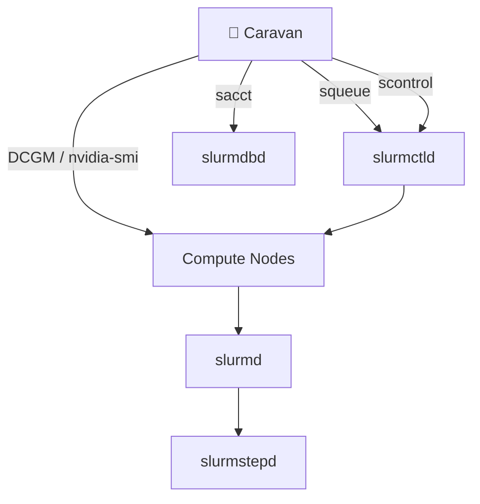
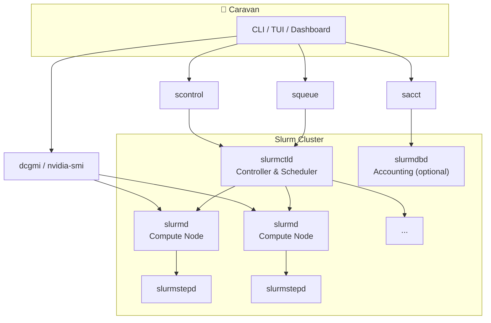

# Caravan 🐪🐫🛕

> ### Make it easy to spin SLURM Cluster and submit your HPC workloads to it.


## Purpose
Slurm is powerful but a chore to operate and submit to. 

Caravan make it easy by bundling everything in a single binary that carries a GPU Slurm cluster *inside it*.

Making it a one-liner to bring up, submit jobs, track experiments and rerun workloads.

> Caravan **uses** Slurm — it doesn't replace it. Slurm stays the scheduler;

> Caravan is the control plane and easier developer experience around it.

Its completing project to:
- [squint](https://github.com/hiteshsahu/squint): TUI Dashboard to check workload & squatting GPUs
- [gpu-lens](https://github.com/hiteshsahu/gpu-lens) : Drop-in GPU + scheduler observability for clusters(SLURM+K8)



---


## ⚡ Prerequisites

📟 Requires **Go 1.22+**

  > choco install golang

  More detail on this [Medium Post](https://medium.com/@hiteshkrsahu/installing-go-on-windows-the-5-minute-guide-and-the-gotchas-nobody-mentions-878eb3ea2277)
  
  **Slurm** will be installed as Container Image

### 🐳 Container engine
Caravan can work with both `Docker` or `Podman`, it auto-detects (`Docker` first, then`Podman`) and uses the matching Compose.

On Podman it uses `podman-compose` if installed, otherwise it will try to use `podman compose`.

You can Force Podman explicitly:

```bash
CARAVAN_ENGINE=podman caravan cluster up
CARAVAN_COMPOSE="podman compose" caravan cluster up
```

On macOS make sure the Podman VM is running first:

```bash
podman machine start
```

##  OS Support

Recommended Platform

| Environment       | Recommendation                                              |
|-------------------|-------------------------------------------------------------|
| 🐧 Linux          | ⭐⭐⭐⭐⭐ Best for full development, testing, and production    |
| 🪟 Windows + WSL2 | ⭐⭐⭐⭐⭐ Best Windows experience, close to Linux               |
| 🍎 macOS          | ⭐⭐⭐⭐ Great for UI and mock-mode development                 |
| 🪟 Native Windows | ⭐⭐⭐ Good for CLI/UI development; use WSL2 for Linux tooling |


### Slurm + Caravan OS Compatibility

| Feature                                    | Linux | Windows + WSL2 |      Windows      |       macOS       |
|--------------------------------------------|:-----:|:--------------:|:-----------------:|:-----------------:|
| Build                                      |   ✅   |       ✅        |         ✅         |         ✅         |
| Run mock mode                              |   ✅   |       ✅        |         ✅         |         ✅         |
| TUI development                            |   ✅   |       ✅        |         ✅         |         ✅         |
| Unit tests                                 |   ✅   |       ✅        |         ✅         |         ✅         |
| Integration tests (mock)                   |   ✅   |       ✅        |         ✅         |         ✅         |
| Live Slurm (`squeue`, `sacct`, `scontrol`) |   ✅   |       ✅        | ⚠️ Remote cluster | ⚠️ Remote cluster |
| DCGM GPU metrics                           |   ✅   |       ✅        |         ❌         |         ❌         |
| `nvidia-smi` GPU metrics                   |   ✅   |       ✅        |         ✅         |    ⚠️ Limited     |
| Full end-to-end testing                    |   ✅   |       ⚠️       |         ❌         |         ❌         |


Notes
-  Live Slurm support in WSL2 works if you have access to a remote Linux Slurm cluster (via SSH) or a local Slurm installation inside WSL2.
-  DCGM requires machine with NVIDIA GPU with CUDA support and the NVIDIA WSL driver stack.
-  nvidia-smi is only available on Windows and inside WSL2 when using the NVIDIA WSL GPU drivers.

---

## Start Your Caravan 🐪🐫

**Once you have CLI ready, you can start cluster and submit jobs**


###  ✨ 1. Using pre compile released Binary (for production)

Quick start with released CLI binary

**On macOS**

```bash
  go install github.com/hiteshsahu/caravan@latest
  caravan
  
  caravan cluster up        # build + start (controller + 2 fake-GPU nodes)
  caravan cluster down      # stop (-v to also wipe volumes)
  caravan cluster status    # container state + sinfo
  caravan submit <script>   # stream a script into sbatch on the controller
```

### 

### ⚙️ 2. Build Locally (for devs)

Quick start with local binary. 

Note: Replace `caravan` with `./caravan` and you can use them for local CLI

📦 **On macOS**

```bash
  go build -o caravan .
  ./caravan
  
  ./caravan cluster up        # build + start (controller + 2 fake-GPU nodes)
  ./caravan cluster down      # stop (-v to also wipe volumes)
  ./caravan cluster status    # container state + sinfo
  ./caravan submit <script>   # stream a script into sbatch on the controller
```


⊞ **On Windows**

**Note:** for PowerShell users: use `./caravan.exe` instead of `./caravan`.

```bash
   go build -o caravan.exe .
   ./caravan.exe --help
  
  ./caravan.exe cluster up        # build + start (controller + 2 fake-GPU nodes)
  ./caravan.exe cluster status    # container state + sinfo
  ./caravan.exe submit workloads/submit_example.sh
  ./caravan.exe cluster down      # stop (-v to also wipe volumes)
```

---


## How it works

### ▶️ Starting Slurm Cluster 

Writes an embedded Slurm scaffold to 
- MacOS:   `~/.caravan/cluster` 
- Windows: `%USERPROFILE%\.caravan\cluster`

and runs `docker`/`podman compose` against it.

```bash
  ./caravan cluster up
```

You can override scafold to your desired directory by passing `CARAVAN_DIR`

```bash
  # override the scaffold location with `CARAVAN_DIR`
  CARAVAN_DIR=/tmp/caravan/cluster ./caravan cluster up
```


- The two compute nodes advertise `gpu:4` each as **fake, count-only GPUs** 
- The real GPU scheduling, no hardware needed (no `nvidia-smi` telemetry).

---

### 📋 Checking Cluster Status

Print container state, then `sinfo`

```bash
  # check job status
  ./caravan cluster status
  ```

<details>
<summary>Output:</summary>

    hitesh@Mac Caravan % ./caravan cluster status
    CONTAINER ID  IMAGE                           COMMAND     CREATED         STATUS                 PORTS       NAMES
    ce05d9f1bbd9  localhost/caravan-slurm:latest  slurmd      15 seconds ago  Up 1 second (healthy)              c1
    0ef798e4b97c  localhost/caravan-slurm:latest  slurmd      15 seconds ago  Up 1 second (healthy)              c2
    2f3e0982f69c  localhost/caravan-slurm:latest  slurmctld   14 seconds ago  Up 14 seconds                      slurmctld

    PARTITION AVAIL  TIMELIMIT  NODES  STATE NODELIST
    gpu*         up   infinite      2    unk c[1-2]
                                c2
</details>


```bash
  podman exec slurmctld squeue
```

<details>
<summary>Output:</summary>
hitesh@Mac Caravan %   podman exec slurmctld squeue

     JOBID PARTITION     NAME     USER ST       TIME  NODES NODELIST(REASON)
         1       gpu caravan-     root PD       0:00      1 (Nodes required for job are DOWN, DRAINED or reserved for jobs in higher priority partitions)
</details>

---

### 📥 Submitting a HPC Workload

Create a simple job script (see `workloads/submit_example.sh`) and submit it:

```bash
  # submit the example script
  ./caravan submit workloads/submit_example.sh

```

<details>
<summary>Output:</summary>
  → submitting workloads/submit_example.sh to local Slurm cluster in /Users/hitesh/.caravan/cluster
  #!/usr/bin/env bash
  #SBATCH --job-name=caravan-test
  #SBATCH --output=caravan-test.out
  #SBATCH --time=00:01:00
  #SBATCH --ntasks=1

echo "Hello from Caravan job on $(hostname)"
sleep 5

echo "Done"
</details>

---

### 💥 Tear Down Slurm Cluster
Tear down cluster and option to clean mounted volumes as well

```bash  
  ./caravan cluster down      
  ./caravan cluster down  -v  # Also remove disc volumes  
```  

---

## 👨‍💻 Development

###  ⚙️ Install dependencies
```bash
    # Install dependencies
    go mod tidy
```

###  🧪 Build & Test

Tests are run as part of CI itself.

 ```bash  
    # Formatting go file
    gofmt -w . 
    
    # Linting
    go vet ./... 
    
    # recursively compiles all packages
    go build ./...   

```

### ▶️ Run

``` bash
    # Run the Engine
    go run .                 # mock
    
```

---

## Architecture




## 📁 Folder Structure

```
  caravan/
  ├── main.go
  ├── internal/
  │   ├── cli/                 # cobra commands
  │   │   ├── root.go
  │   │   ├── cluster.go       # caravan cluster up|down|status
  │   │   └── submit.go        # caravan submit <script.sh>
  │   └── cluster/
  │       ├── engine.go        # Engine interface + DockerEngine/PodmanEngine
  │       ├── compose.go       # compose file path + project name
  │       ├── extract.go       # embedded scaffold + extraction
  │       ├── status.go        # Up/Down/Status
  │       ├── submit.go        # Submit — streams a script into sbatch
  │       ├── util.go          # process-running helpers
  │       └── assets/          # the GPU Slurm cluster, embedded in the binary
  │           ├── Dockerfile · entrypoint.sh
  │           ├── docker-compose.yml
  │           └── slurm.conf · gres.conf
```

The cluster definition is embedded with `//go:embed`, so the binary is
self-contained — there's no separate cluster repo to clone. `caravan cluster up`
extracts it and runs it via a `docker`/`podman` `Engine`.

----

## 🗺️ Roadmap

Caravan grows from "runs a cluster" to "runs your work on it."

- **cluster** *(here)* — `up` / `down` / `status`, behind a single `Engine` interface
  implemented by Docker and Podman today; cloud / bare-metal backends later.
- **submit** *(here)* — `caravan submit script.sh` streams the script straight into
  `sbatch` on the controller. `logs` to follow it; recording/rerun next.
- **rerun** — re-launch a past job by id, reproducibly.
- **exp** — group runs into experiments and compare them.

Each new capability sits behind a `Backend` interface (Slurm today), so swapping
the execution target later doesn't touch the CLI above it.

---

## License
*© 2026 [Hitesh Kumar Sahu](https://hiteshsahu.com) · Licensed under [Apache 2.0](https://www.apache.org/licenses/LICENSE-2.0)*

