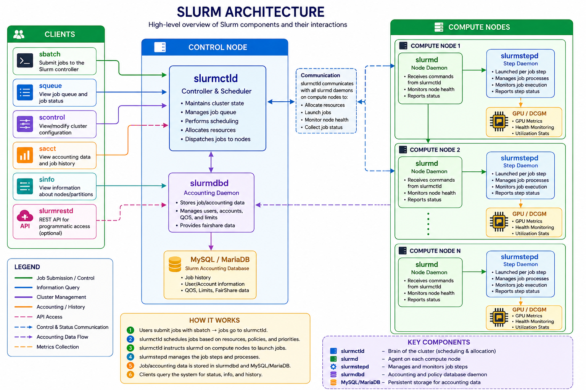
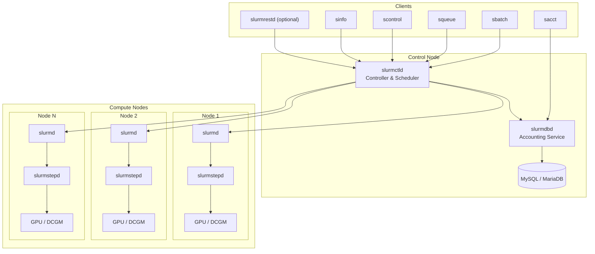
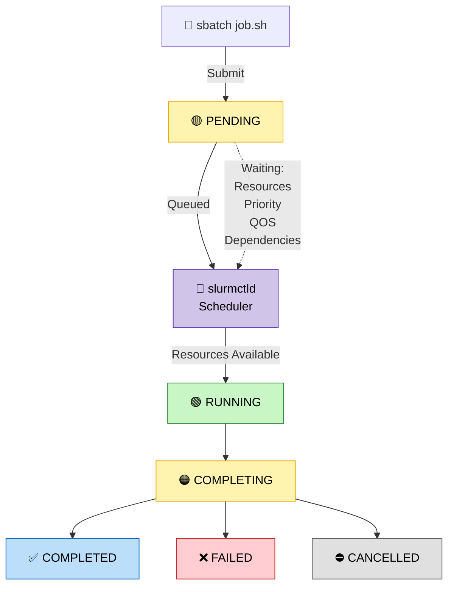

# How Slurm Works

A working mental model of Slurm — the scheduler Caravan stands up and submits to.
Written from the parts you actually touch when you build a cluster, not the man
pages.

## The one-sentence model

**Slurm is a queue plus a placement engine.** You hand it jobs that declare what
they need (CPUs, memory, GPUs, time); it decides *which machine runs each job and
when*, then launches it there and tracks it to completion. Everything else —
priorities, fairshare, accounting, GRES — is detail hanging off those two jobs.

## The daemons (control plane vs. compute plane)

Slurm is a handful of long-running daemons that talk to each other:

### **`slurmctld`**
> the brain. 
- One per cluster (two for HA).
- It owns the queue and every scheduling decision. 

When people say "Slurm is hard to replace," they mean this: 20 years of scheduling logic live here.

### **`slurmd`** 
> Worker 
-  Runs on *every* compute node.
- It reports the node's health to the
  controller and, when told, launches the job — spawning a **`slurmstepd`** that
  actually manages the job's processes and tears them down after.

### **`slurmdbd`** — optional. 
> The accounting daemon, backed by a SQL database.

 It  stores job history (`sacct`), and the *associations / QOS / fairshare* that drive
  limits and priority. 
 
 **Caravan's dev cluster skips it** (`accounting_storage/none`)
  because squint only reads live state, never history — which removes a whole
  database and its startup races.

## munge: why every node trusts every node

Daemons and clients authenticate every message with **munge**.

There's a single shared key (`/etc/munge/munge.key`) on every node; `munged` uses it to mint and
verify time-limited credentials. 

No munge, no cluster — `slurmctld` and `slurmd` literally can't talk. (This is exactly the permission error that bites Slurm-in-
container setups: if `munged` can't open its socket, the whole stack fails to
start.)

## The life of a job

1. **Submit.** `sbatch` sends a batch script + a resource request to `slurmctld`,
   which assigns a job ID and parks it in the queue as **PENDING**.
2. **Wait.** The job sits PENDING with a **reason** until it can run — that reason
   is the cryptic code (`Resources`, `Priority`, `QOSMaxGRESPerUser`, …) that
   squint translates into plain English.
3. **Schedule.** The scheduling loop walks pending jobs in priority order; when a
   set of nodes satisfies a job's CPUs/memory/GRES/time, the controller allocates
   them and hands the job to the relevant `slurmd`s.
4. **Run.** `slurmd` spawns `slurmstepd`, which sets the job's environment (the
   `SLURM_*` vars, and **`CUDA_VISIBLE_DEVICES`** for allocated GPUs) and runs the
   script. State becomes **RUNNING**.
5. **Finish.** The job ends, runs any epilog (**COMPLETING**), frees its resources,
   and lands in **COMPLETED / FAILED / CANCELLED**.

## How placement is actually decided

Slurm doesn't just FIFO. Placement is shaped by:

- **Partitions** — named queues over a set of nodes, each with its own limits
  (max time, allowed accounts). A job targets a partition; `gpu` is ours.
- **Priority** — the *multifactor* plugin blends age, job size, partition, QOS, and
  **fairshare** (recent usage per account) into one number. Higher runs first.
- **Backfill** — the clever bit: lower-priority jobs are allowed to start early
  *if they finish before they'd delay any higher-priority job*. This is why
  accurate `--time` limits matter — without them, backfill can't reason and the
  cluster drains.
- **QOS** — quality-of-service tiers that cap and prioritize (e.g. "you may hold at
  most 8 GPUs in this QOS" → the `QOSMaxGRESPerUser` pending reason).
- **Preemption** — higher-priority work can suspend or requeue lower-priority work.

## Resources, and how GPUs are modeled

A node advertises **CPUs** (sockets × cores × threads), **RealMemory**, and
**GRES** (generic resources). GPUs are just a GRES named `gpu`:

- **`SelectType=select/cons_tres`** is what lets Slurm hand out CPUs, memory, *and*
  GPUs at sub-node granularity — so two jobs can share a node, each with its own
  GPUs. (Older `linear` gave you whole nodes only.)
- **`gres.conf`** maps the GPUs on each node. With `File=/dev/nvidiaN`, Slurm binds
  specific devices and sets `CUDA_VISIBLE_DEVICES` to the allocated indices —
  that's how a job "sees" only its GPUs. **Count-only** GRES (no `File=`, what
  Caravan's fake GPUs use) tracks the *count* for scheduling but can't bind real
  devices — perfect for testing scheduling without hardware.
- **TRES** (trackable resources) is the unifying abstraction: cpu, mem, `gres/gpu`,
  node, and `billing` are all TRES, which is how limits and fairshare can reason
  about GPUs the same way they reason about cores.

## The commands, and which daemon answers

| Command    | Does                                           | Talks to           |
|------------|------------------------------------------------|--------------------|
| `sbatch`   | submit a batch script                          | slurmctld          |
| `srun`     | launch a job step (inside or as an allocation) | slurmctld → slurmd |
| `salloc`   | grab an interactive allocation                 | slurmctld          |
| `squeue`   | view the live queue                            | slurmctld          |
| `sinfo`    | view node / partition state                    | slurmctld          |
| `scontrol` | inspect/modify jobs, nodes, config             | slurmctld          |
| `scancel`  | cancel a job                                   | slurmctld          |
| `sacct`    | job *history*                                  | slurmdbd           |
| `sacctmgr` | manage accounts / QOS / limits                 | slurmdbd           |

The split that matters: **live state** (`squeue`, `sinfo`, `scontrol`) comes from
`slurmctld` and needs no database; **history** (`sacct`) needs `slurmdbd`. That's
why squint — which only wants "what's running now" — works against a cluster with
no accounting at all.

## Why Slurm feels archaic (and where tools like Caravan fit)

Slurm is extraordinary at scheduling and unforgiving at *everything around it*:

- **Config is text files** that must agree across nodes (`slurm.conf`, `gres.conf`).
- **Submitting is boilerplate** — `#SBATCH` directives, the right `--gres` syntax,
  module/conda setup, environment that differs between login and compute nodes.
- **Errors are codes** — `Reason=(QOSMaxGRESPerUser)` instead of "you're over your
  GPU quota."
- **Observability is `squeue` + `sacct`** — powerful, but not a dashboard.

None of that is a scheduling problem; it's a *developer-experience* problem. That's
the gap Caravan and squint target — keep Slurm as the proven engine, and put a
humane control plane and a real-time view on top.

## How this maps to Caravan's cluster

The dev cluster Caravan embeds is a deliberately minimal version of all the above:

| Concept       | In Caravan's cluster                                     |
|---------------|----------------------------------------------------------|
| controller    | `slurmctld` container                                    |
| compute nodes | `c1`, `c2` running `slurmd`                              |
| auth          | shared munge key baked into the image                    |
| GPUs          | count-only `gpu:4` per node (`gres.conf`, no `File=`)    |
| accounting    | **none** — no `slurmdbd`, no database                    |
| isolation     | `proctrack/linuxproc` + `task/none` (container-friendly) |

It's the smallest thing that is still *real* Slurm — enough to schedule GPU jobs,
exercise pending reasons, and give squint something true to watch.